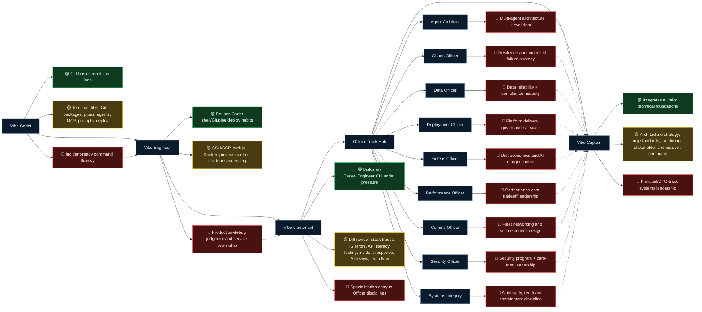

# Station Delta Spec Writer Progression Mind Map (13 Courses)

Legend: 🟢 review/reinforce · 🟡 new skill · 🔴 leads to next course(s)

## Course-by-Course Skill Map

### 1) Vibe Cadet
- 🟢 Review: command-line orientation and repetition loops.
- 🟡 New: terminal navigation, file operations, Git workflow/conflicts, package management, pipes/grep, agent basics, MCP, prompt chaining, production deploy basics.
- 🔴 Leads to: Vibe Engineer (incident CLI realism), Vibe Lieutenant (code-review readiness).

### 2) Vibe Engineer
- 🟢 Review: Cadet command fluency, Git safety habits, environment variable handling.
- 🟡 New: SSH key auth, SCP transfers, remote execution, API operations with curl, JSON parsing with jq, Docker lifecycle, live incident triage, advanced Git recovery (stash/rebase/bisect/cherry-pick).
- 🔴 Leads to: Vibe Lieutenant (debugging judgment + team-safe execution under pressure).

### 3) Vibe Lieutenant
- 🟢 Review: shell fluency from Cadet/Engineer.
- 🟡 New: codebase navigation at scale, diff strategy, stack trace reading, TypeScript/build-error interpretation, API/data literacy, testing fundamentals, incident protocol, AI code review patterns, team branch/PR workflow.
- 🔴 Leads to: Officer specialization tracks via domain depth selection.

### 4) Agent Architect (Officer)
- 🟢 Review: AI-agent basics from Cadet/Lieutenant.
- 🟡 New: ReAct loops, supervisor/specialist coordination, eval frameworks, RAG debugging, guardrails, stateful memory, cost/latency governance, production tracing.
- 🔴 Leads to: Captain-level AI platform architecture decisions.

### 5) Chaos Officer
- 🟢 Review: incident handling from Engineer/Lieutenant.
- 🟡 New: failure injection, blast-radius mapping, resilience patterns, game-day operation, recovery automation, post-mortem rigor.
- 🔴 Leads to: Captain-level resilience strategy and incident command.

### 6) Data Officer
- 🟢 Review: API/data literacy from Lieutenant.
- 🟡 New: SQL safety, ETL orchestration, vector/RAG data pipelines, data quality gates, streaming, privacy/compliance, lineage forensics, zero-downtime migration.
- 🔴 Leads to: Captain-level data strategy and governance decisions.

### 7) Deployment Officer
- 🟢 Review: Git/deploy baseline from Cadet/Engineer/Lieutenant.
- 🟡 New: CI pipelines, artifact lifecycle, GitOps, secrets/config discipline, canary/blue-green rollout control, IaC, environment promotion gates, deployment forensics.
- 🔴 Leads to: Captain-level platform release strategy.

### 8) FinOps Officer
- 🟢 Review: cost awareness from prior runtime/deploy work.
- 🟡 New: spend visibility, token economics, feature-level attribution, ROI linkage, break-even/payback math, keep/optimize/kill decisions, forecasting guardrails, executive reporting.
- 🔴 Leads to: Captain-level strategy tied to technical + business tradeoffs.

### 9) Performance Officer
- 🟢 Review: observability and incident fundamentals.
- 🟡 New: profiling/flame analysis, tracing slow paths, AI-specific latency bottlenecks, query/index tuning, right-sizing/auto-scale, cost attribution, caching, production load testing.
- 🔴 Leads to: Captain-level scaling and reliability investment planning.

### 10) Comms Officer
- 🟢 Review: API and network touchpoints from prior tracks.
- 🟡 New: ports/protocols, HTTP/TLS depth, DNS operations, firewall/zero-trust controls, load balancing, service mesh, deep network debugging, secure communication architecture.
- 🔴 Leads to: Captain-level distributed systems communication design.

### 11) Security Officer
- 🟢 Review: least privilege + secret hygiene from earlier phases.
- 🟡 New: perimeter defense, injection prevention, auth/session hardening, secrets ops, DDoS defense, AI-assisted vuln scanning, STRIDE threat modeling, incident response, security program governance.
- 🔴 Leads to: Captain-level risk strategy and policy leadership.

### 12) Systems Integrity
- 🟢 Review: observability + AI workflow fundamentals.
- 🟡 New: silent-failure detection, adversarial testing harnesses, circuit-breaker containment, human-in-loop escalation, decision auditability, integrity forensics, live patch discipline.
- 🔴 Leads to: Captain-level safe AI operations and governance.

### 13) Vibe Captain
- 🟢 Review: all core + specialization skills integrated.
- 🟡 New: architecture strategy, large-scale decision quality, mentoring systems, cross-functional communication, technical-roadmap framing, incident command leadership.
- 🔴 Leads to: principal/staff+/CTO trajectory competencies.

## Spec Writer Progression Check (Natural Learning Flow)

- ✅ Core scaffold is coherent: Cadet (command fluency) → Engineer (live operations) → Lieutenant (software-engineering judgment).
- ✅ Officer split is well-placed after Lieutenant: each specialization assumes shared debugging/review rigor.
- ✅ Captain as convergence capstone is structurally correct: it consumes all prior tracks as leadership inputs.
- ✅ `index_v2.html` alignment confirmed: it explicitly surfaces `Vibe Engineer`, shows all 13 simulations, and publishes track-path sequencing (Security, Deployment, AI/Automation, Data) with Captain convergence.
- ⚠️ Minor publish-state note: `index_v2.html` still labels Engineer as “Coming Soon” in footer/pricing copy while the sim card is present. Keep copy state synced with launch state to avoid learner confusion.
